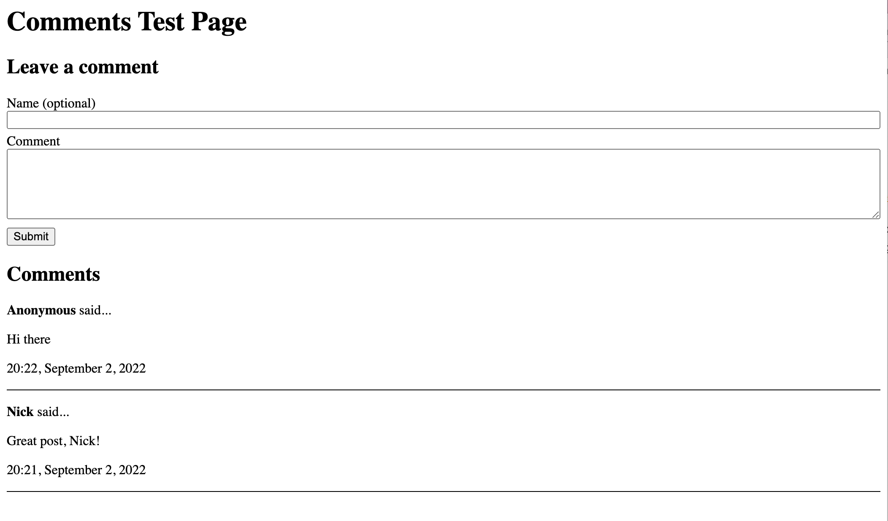

# nbb-comments

A service for adding basic comment functionality to any blog post/webpage. Visitors to your site can leave comments and view others' comments.

- Built with [nbb](https://github.com/babashka/nbb)
- Deployed on AWS Lambda using [Serverless Framework](https://www.serverless.com/)
- Uses DynamoDB for storage

You can:
- [Deploy it](#using-it-on-your-own-site) to your own AWS account to use it on your own site
- [Run it locally](#running-server-locally) to poke around and see how it works
- [See it in action](https://nickcellino.com/blog/2022-08-07-clojure-bandits.html) (scroll to the bottom of the linked page)

## Why

I wanted to allow people visiting [my personal blog](https://nickcellino.com) to be able to leave comments without creating any sort of account/login. I used Google reCAPTCHA v3 to prevent bot abuse.

## Overview

`nbb-comments` uses an AWS Lambda function (backed by DynamoDB) to serve HTTP requests to:
- add a new comment for a certain blog post
- list existing comments for a certain blog post
- retrieve the HTML to render the comments form

It uses [htmx](https://htmx.org/) to handle interactions with the server and make dynamic updates to the DOM without reloading the page.

Once you deploy your backend, adding it to any webpage is as simple as:
```html
<!-- add this to <head> -->
<script src="https://unpkg.com/htmx.org@1.8.0" async></script>

<!-- add this somewhere in your <body> -->
<h2>Leave a comment</h2>
<form id="comment-form" hx-get="https://<your-deployed-lambda-url>/comments-form?post-id=example-post-id" hx-trigger="load"></form>

<h2>Comments</h2>
<div id="comments-list" hx-get="https://<your-deployed-lambda-url>/comments?post-id=example-post-id" hx-swap"innerHTML" hx-trigger="load"></div>
```

## Running server locally

##### Prerequisites
- Install [babashka](https://babashka.org/)
- Install [node/npm](https://nodejs.org/en/download/)

First, install node dependencies:
```bash
npm install
```

Then, to run the server locally, run:
```bash
bb dev-server
```

Then visit `http://localhost:3000` and you can see it in action!

## Using it on your own site

To use this for your own blog/site, you will need to:

1. [Deploy your own instance](#deploy-your-own-instance)
2. [Hook it up to your frontend](#hook-it-up-to-your-frontend)

### Deploy your own instance

#### Prerequisites
- [Setup your AWS credentials](https://www.serverless.com/framework/docs/providers/aws/guide/credentials) so that you can deploy using Serverless Framework 
- [Register a Google reCAPTCHA v3 key](https://www.google.com/recaptcha/admin/create)
- Install [node/npm](https://nodejs.org/en/download/)

1. Create an `.env` with the following contents:

    ```
    RECAPTCHA_SECRET="<your-recaptcha-secret-here>"
    RECAPTCHA_SITEKEY="<your-recaptcha-sitekey-here>"
    ALLOWED_ORIGIN_URL="<your-frontend-url>" # for example "https://nickcellino.com"
    ```

2. Run `npm install` in the root of this project.

3. Run `npx serverless deploy`. If everything worked correctly, this should print out something like:
    ```bash
    ➜  npx serverless deploy

    Deploying comments-api to stage dev (us-east-1)

    ✔ Service deployed to stack comments-api-dev (84s)

    endpoint: ANY - https://s390h072qf.execute-api.us-east-1.amazonaws.com/{proxy+}
    functions:
      comments-api: comments-api-dev-comments-api (65 MB)

    Monitor all your API routes with Serverless Console: run "serverless --console"
    ```

Take note of the endpoint url you get back. In this example, it is `https://s390h072qf.execute-api.us-east-1.amazonaws.com`

If you can see that, your backend is all set!

### Hook it up to your frontend

1. Load `htmx` script somewhere in the `<head>` of your HTML like so:
    ```html
    <head>
    ...
    <script src="https://unpkg.com/htmx.org@1.8.0" async></script>
    ...
    </head>
    ```
    This is used to dynamically fetch the comments form and comments from the backend.

2. Add the comments form somewhere on your page like so (replacing *your-backend-url* with the proper value for your backend):
    ```html
    <form
      id="comment-form"
      hx-get="<your-backend-url>//localhost:3000/comments-form?post-id=example-post-id"
      hx-trigger="load">
    </form>
    ```

3. Add the comments list (where the comemnts will actually be displayed) somewhere on your page like so (replacing *your-backend-url* with the proper value for your backend):
    ```html
    <div
      id="comments-list"
      hx-get="<your-backend-url>/comments?post-id=example-post-id"
      hx-swap"innerHTML"
      hx-trigger="load">
    </div>
    ```

Once you have done that, you are all set to receive brilliant insights from random strangers on the internet!

You can find a minimal working example of this [here](./src/dev/index.html).

## Styling

The HTML snippets above will load HTML from the server and render it onto the page.
You will need to know what that rendered HTML looks like in order to style it.

You can also run [the dev server](#running-server-locally) to play around with the styling.

#### Rendered "add comment" form example

```html
<form
  id="comment-form"
  hx-post="http://localhost:3000/comments"
  hx-swap="afterbegin"
  hx-target="#comments-list"
  hx-trigger="submit"
  hx-swap-oob="true"
  class="">

  <input type="hidden" name="post-id" value="example-post-id">
  <label for="author">Name (optional)</label>
  <input type="text" name="author" id="author-input" hx-swap-oob="true">
  <label for="message">Comment</label>
  <textarea name="message" required="true" rows="5" id="message-input" hx-swap-oob="true"></textarea>

  <script>
    function announce(token) {
      const event = new Event('recaptcha-verified');
      const elem = document.querySelector('#comment-form');
      elem.dispatchEvent(event);
    }
  </script>
  <script src="https://www.google.com/recaptcha/api.js"></script>

  <button type="submit">Submit</button>

</form>
```

#### Rendered comment list example

```html
<div
  id="comments-list"
  hx-get="http://localhost:3000/comments?post-id=example-post-id"
  hx-swap="innerhtml"
  hx-trigger="load">
 
  <div class="comment">
    <p class="name">
      <strong>Anonymous</strong> said...
    </p>
    <p class="message">Hi there</p>
    <p class="datetime">20:22, September 2, 2022</p>
  </div>

  <div class="comment">
    <p class="name">
      <strong>Nick</strong> said...
    </p>
    <p class="message">Great post, Nick!</p>
    <p class="datetime">20:21, September 2, 2022</p>
  </div>

</div>
```

#### Styling example

There is a very, very basic example of styling in [the example HTML](./src/dev/index.html).

```html
<style>
  .comment {
    border-bottom: 1px solid;
  }

  input, textarea {
    width: 100%;
    margin-bottom: 5px;
  }

  button {
    margin-top: 5px;
  }
</style>
```

That will result in this magnificence:



Please, hold your applause.
